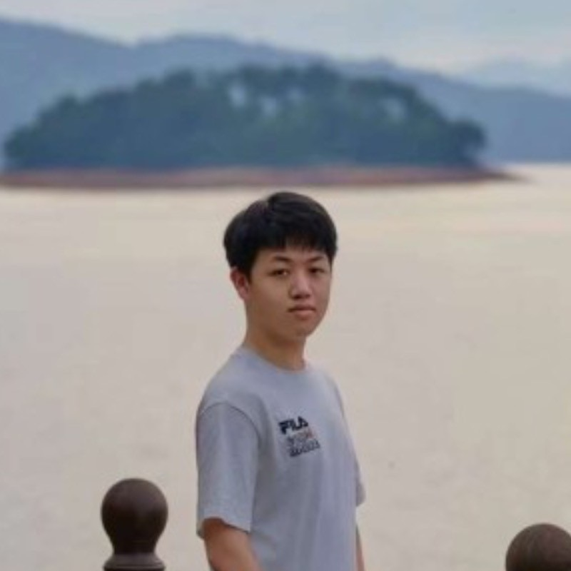

# Richard's User Page
## About me


I am a first year student majoring in **Computer Science** from **UCSD**. I am passionate about *everything* in CS. ~~Given these information it is not hard to that tell I am one of the guys waiting to be replaced by LLMs.~~
If you happend to be interested about me as a person, [Click here](#extra-information)
I don't really have any favorite quotes but here is one:
> ”A cup of coffee, a cigarette; one single bug, a day to fix.“

Although I don't smoke at all.

Here is the first code I wrote in my life. It happend in the good old days before COVID.

``` C++
#include <bits/stdc++.h>
using namespace std;
int main(){
    cout << "Hello World!" << endl;
    return 0;
}
```
[My empty LinkedIn, because putting a github link here would create a recursion](https://www.linkedin.com/in/chenhao-nie-651915304/)

## The README
[Right over here](README.md)

## Extra Information
My name is Richard Nie, if that matters.
My hobbies:
1. Daydreaming
2. Gaming
3. Listening to music
4. Traveling
5. Watching animes and TV dramas

My favorite food:
- Sichuan cuisine
- Japanese cuisine
- I'm too lazy to name all

Some personal goals:
- [x] Know the campus
- [ ] Walk out of the UTC-UCSD circle
- [ ] Learn how to sing